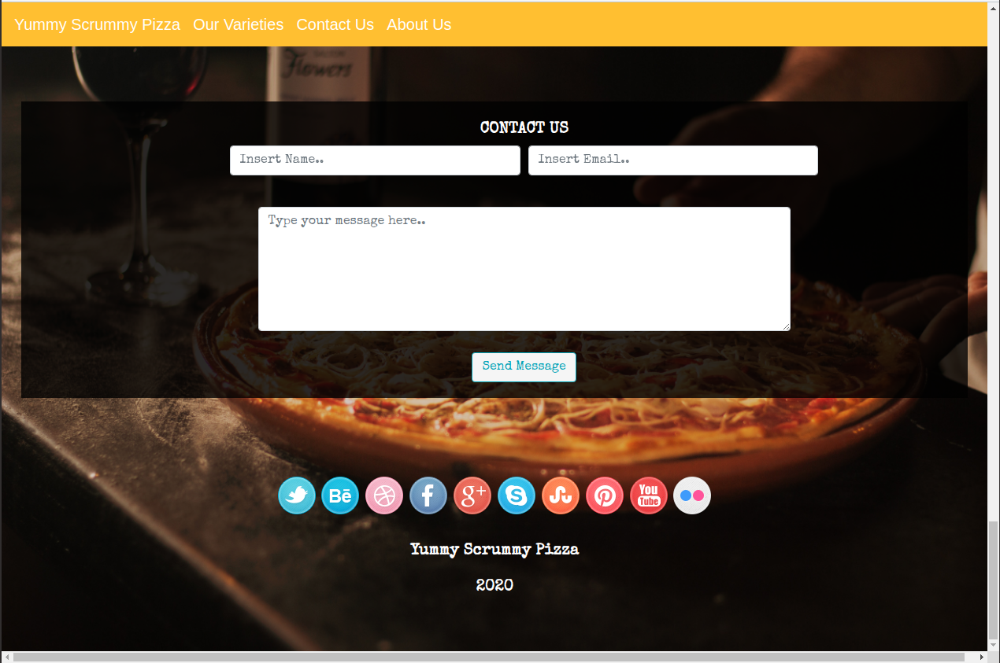
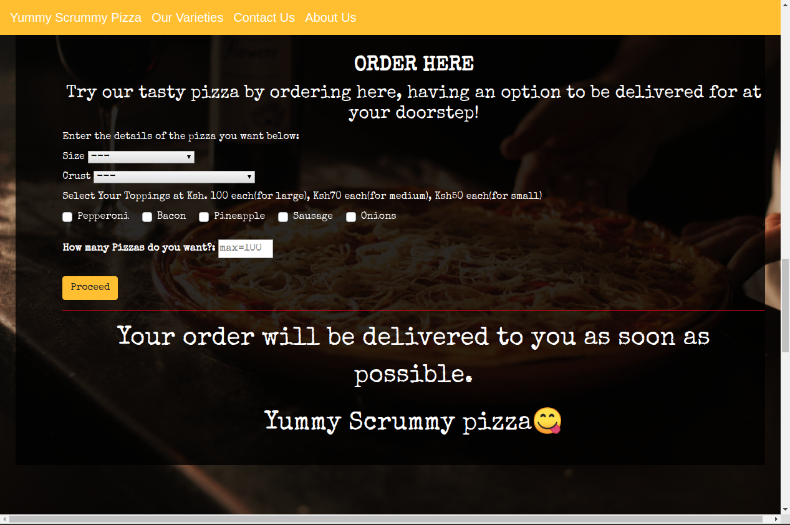

# Yummy Scrummy Pizza.
<table>
<tr>
<td>
  
#### This is a webpage that enhances customer service by offering pizza deliveries, Current version 2020
</table>
</tr>
</td>

#### By **Kingsleymuturi**
  
## Description
Yummy Scrummy Website, is a website that helps users get pizza at their doorsteps by offering quick deliveries countrywide and also has a section for users to give feedback on our service.
## Access
* click the live link to be directed directly to the webpage:
https://Kingsleymuturi.github.io/yummy-scrummy-pizza

* This section allows users to give us their feedback:

* This is where our esteemed cutomers place their orders:

## Known Bugs
Some texts might duplicate themselves due to button errors.
### Development
Want to contribute? Great!

To fix a bug or enhance an existing module, follow these steps:

- Fork the repo
- Create a new branch (`git checkout -b improve-feature`)
- Make the appropriate changes in the files
- Add changes to reflect the changes made
- Commit your changes (`git commit -m 'Improve feature'`)
- Push to the branch (`git push origin improve-feature`)
- Create a Pull Request 

## Technologies Used
During the creation of this webpage I used HTML, CSS and also JavaScript came in handy along with jQuery
## Support and contact details
In case of anything find me here: kingsleymuturi9@gmail.com feel free to communicate any issue with the webpage

### [LICENSE](https://github.com/Kingsleymuturi/yummy-scrummy-pizza/blob/master/LICENSE)
Copyright (c) 2020 [Kingsley Muturi ](https://github.com/Kingsleymuturi)
